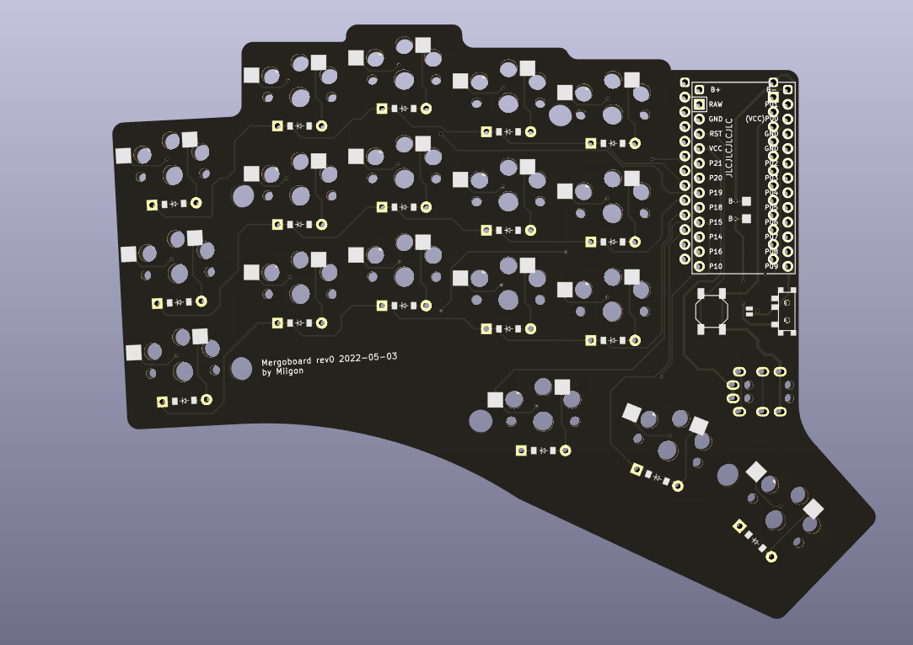
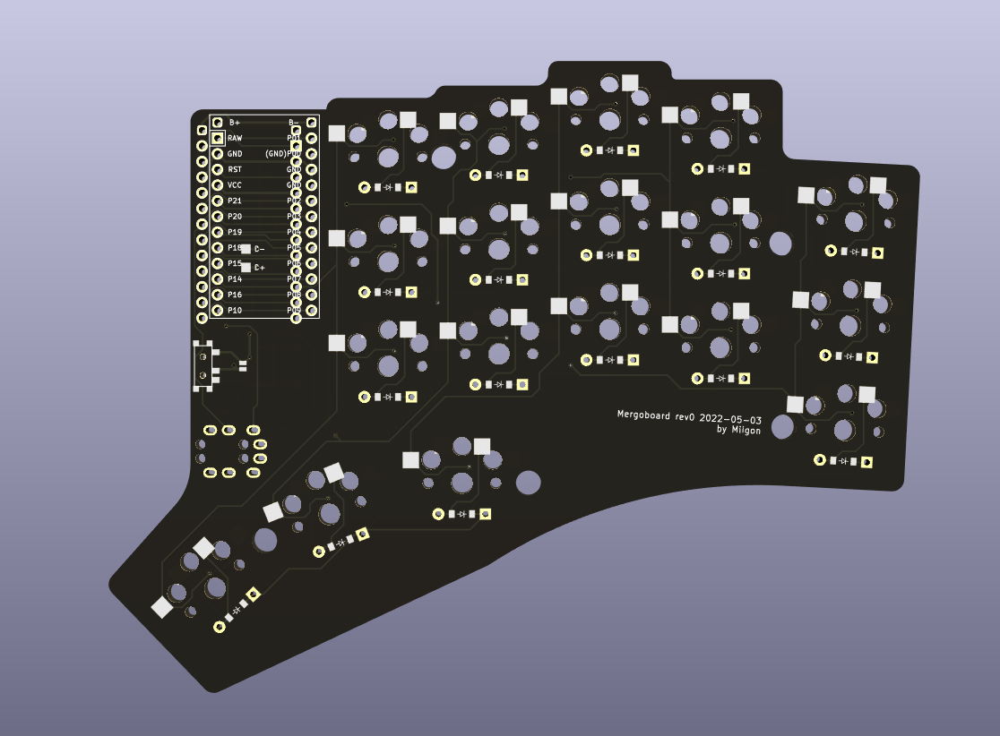
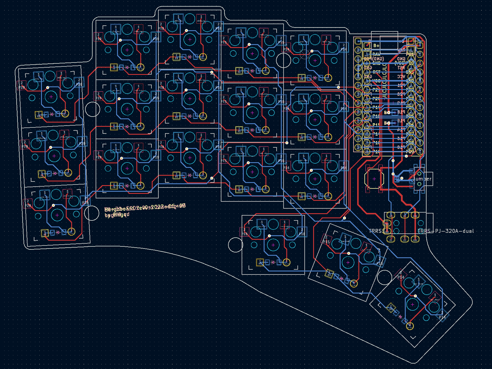

# Mergoboard

38-key split ergonomic keyboard made with #ergogen.
## Note
This project is heavily based on [samoklava](https://github.com/soundmonster/samoklava) and uses much of the same footprints.
All the additional footprints or modified footprints are in the `footprints` folder.

## Screenshot
### rev0 (2020-05-02)

